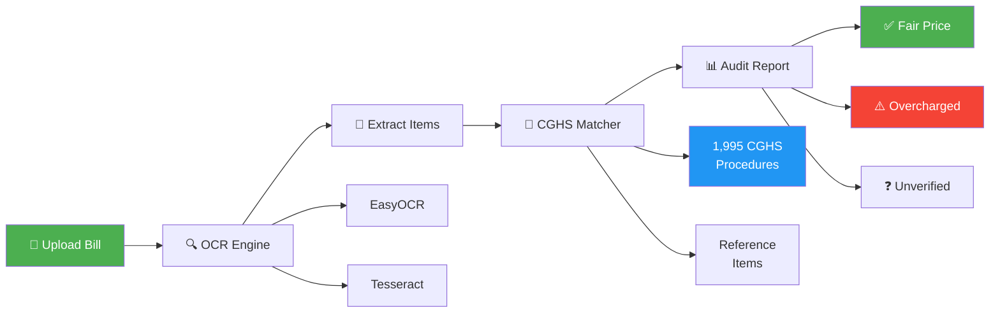
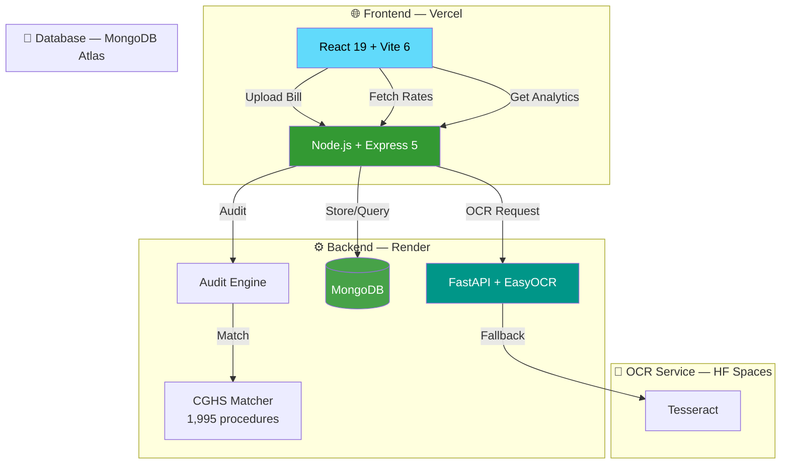

<div align="center">

# 🏥 Sanjeevani

### *AI-Powered Healthcare Billing Transparency Platform*

[](https://algofest.dev)
[](https://algofest.dev)
[](https://sanjeevani-healthcare.vercel.app)

<br/>

[](https://react.dev)
[](https://nodejs.org)
[](https://python.org)
[](https://mongodb.com)
[](https://fastapi.tiangolo.com)
[](https://github.com/JaidedAI/EasyOCR)

<br/>

**Sanjeevani** (संजीवनी) — *the life-giving herb from ancient Indian mythology* — is an AI-powered platform that fights medical billing fraud by automatically scanning hospital bills, cross-referencing with **1,995 official CGHS government rates**, and exposing overcharges that patients would never catch on their own.

<br/>

[🌐 Live Demo](https://sanjeevani-healthcare.vercel.app) · [📖 API Docs](https://sanjeevani-backend-blh0.onrender.com/health) · [🤖 OCR Service](https://rachit-ai-sanjeevani-ocr.hf.space/docs) · [🐛 Report Bug](https://github.com/Rachit-Kakkad1/Sanjeevani/issues) · [✨ Request Feature](https://github.com/Rachit-Kakkad1/Sanjeevani/issues)

</div>

---

## 📋 Table of Contents

- [🎯 The Problem](#-the-problem)
- [💡 Our Solution](#-our-solution)
- [🔬 How It Works](#-how-it-works)
- [✨ Key Features](#-key-features)
- [🏗️ System Architecture](#️-system-architecture)
- [🛠️ Tech Stack](#️-tech-stack)
- [🚀 Quick Start](#-quick-start)
- [🌐 Deployment](#-deployment)
- [📊 API Reference](#-api-reference)
- [🗂️ Project Structure](#️-project-structure)
- [🤝 Contributing](#-contributing)
- [👥 Team](#-team)
- [📜 License](#-license)

---

## 🎯 The Problem

<table>
<tr>
<td width="60%">

### Medical billing fraud is a ₹12,000 Cr+ problem in India

- 🏥 **80%** of hospital bills contain errors or inflated charges
- 💸 Patients are overcharged by **30-400%** above government-approved CGHS rates
- 📄 Medical bills are deliberately complex and opaque
- 🤷 Most patients lack the knowledge to identify overcharges
- ⚖️ No accessible tool exists for real-time bill verification

> *"A patient charged ₹12,500 for an MRI Brain scan that should cost only ₹5,000 as per CGHS rates — that's a 150% overcharge."*

</td>
<td width="40%" align="center">

### Real Impact

```
┌─────────────────────────┐
│   Before Sanjeevani     │
│                         │
│   MRI Brain:  ₹12,500   │
│   CT Scan:    ₹14,000   │
│   ECG:        ₹800      │
│   ─────────────────     │
│   Total:      ₹27,300   │
│                         │
│   After Sanjeevani      │
│                         │
│   Fair Rate:  ₹10,350   │
│   Overcharge: ₹16,950   │
│   Saved:      62%       │
└─────────────────────────┘
```

</td>
</tr>
</table>

---

## 💡 Our Solution

**Sanjeevani** is a 3-tier AI-powered platform that:

| Step | Action | Technology |
|:---:|:---|:---|
| 📸 | **Scan** — Upload a photo of any hospital bill | EasyOCR + Tesseract (dual engine) |
| 🧠 | **Analyze** — AI extracts line items, prices & quantities | Intelligent layout parsing + noise filtering |
| ⚖️ | **Audit** — Cross-reference against 1,995 CGHS procedures | Fuse.js fuzzy matching (99% confidence) |
| 📊 | **Report** — Show exactly where you've been overcharged | Real-time dashboard with charts |
| 💰 | **Save** — Get a detailed refund claim report | Itemized audit with government rate citations |

---

## 🔬 How It Works



### The Dual-Source Audit Pipeline

```
Bill Item: "MRI Brain With Contrast" → ₹12,500
                    │
                    ▼
        ┌───────────────────────┐
        │  Source 1: ReferenceItem │  ← Curated seed data
        │  Match? ❌ No           │
        └───────────┬───────────┘
                    │
                    ▼
        ┌───────────────────────┐
        │  Source 2: CGHS Fuse.js │  ← 1,995 govt procedures
        │  Match? ✅ Yes          │
        │  → "MRI Brain – With    │
        │    Contrast"             │
        │  NABH Rate: ₹5,000      │
        │  Confidence: 99%         │
        └───────────┬───────────┘
                    │
                    ▼
        ┌───────────────────────┐
        │  🚨 OVERCHARGED        │
        │  Billed:  ₹12,500      │
        │  Fair:    ₹5,000        │
        │  Excess:  ₹7,500 (150%)│
        └───────────────────────┘
```

---

## ✨ Key Features

<table>
<tr>
<td align="center" width="33%">
<h3>🔍 Smart OCR</h3>
<p>Dual-engine OCR (EasyOCR + Tesseract) with intelligent noise filtering that rejects phone numbers, GSTIN, and invoice IDs</p>
</td>
<td align="center" width="33%">
<h3>⚖️ CGHS Audit Engine</h3>
<p>Cross-references against 1,995 official CGHS procedures with Fuse.js fuzzy matching at 99% confidence</p>
</td>
<td align="center" width="33%">
<h3>📊 Real-time Dashboard</h3>
<p>Beautiful analytics with spending trends, overcharge charts, and AI-powered smart insights</p>
</td>
</tr>
<tr>
<td align="center" width="33%">
<h3>💊 Jan Aushadhi Locator</h3>
<p>Find nearest Jan Aushadhi stores for affordable generic medicines using MapMyIndia integration</p>
</td>
<td align="center" width="33%">
<h3>🏛️ Gov Schemes</h3>
<p>Discover Ayushman Bharat, PMJAY, and other healthcare schemes you're eligible for</p>
</td>
<td align="center" width="33%">
<h3>🔐 Secure Auth</h3>
<p>Google OAuth 2.0 integration with JWT-based session management and Helmet security</p>
</td>
</tr>
</table>

---

## 🏗️ System Architecture



---

## 🛠️ Tech Stack

### Frontend
| Technology | Purpose |
|:---|:---|
|  | UI framework with hooks & context |
|  | Lightning-fast build tool |
|  | Smooth animations & transitions |
|  | Data visualization & charts |
|  | Store locator maps |

### Backend
| Technology | Purpose |
|:---|:---|
|  | Runtime environment |
|  | REST API framework |
|  | Cloud database |
|  | ODM & schema validation |
|  | Fuzzy matching engine |

### OCR Service
| Technology | Purpose |
|:---|:---|
|  | OCR service runtime |
|  | High-performance API |
|  | Primary OCR engine |
|  | Fallback OCR engine |
|  | Deep learning backend |

### DevOps & Deployment
| Technology | Purpose |
|:---|:---|
|  | Frontend hosting |
|  | Backend hosting |
|  | OCR service hosting |
|  | Containerized OCR |
|  | CI/CD pipeline |

---

## 🚀 Quick Start

### Prerequisites

```bash
Node.js >= 18    # Backend & Frontend
Python >= 3.10   # OCR Service
MongoDB          # Database (or use Atlas)
```

### 1️⃣ Clone the Repository

```bash
git clone https://github.com/Rachit-Kakkad1/Sanjeevani.git
cd Sanjeevani
```

### 2️⃣ Start the Backend

```bash
cd backend
npm install
cp .env.example .env    # Configure your environment
npm run dev             # Starts on port 5000
```

### 3️⃣ Start the OCR Service

```bash
cd ocr-service
python -m venv venv
source venv/bin/activate    # Windows: .\venv\Scripts\activate
pip install -r requirements.txt
uvicorn app.main:app --host 0.0.0.0 --port 8000
```

### 4️⃣ Start the Frontend

```bash
cd frontend
npm install
npm run dev             # Starts on port 5173
```

### 5️⃣ Open in Browser

```
🌐 Frontend:  http://localhost:5173
⚙️ Backend:   http://localhost:5000/health
🤖 OCR:       http://localhost:8000/ocr/health
📖 OCR Docs:  http://localhost:8000/docs
```

---

## 🌐 Deployment

Sanjeevani is deployed across three cloud platforms for reliability and performance:

| Service | Platform | URL | Status |
|:---|:---|:---|:---:|
| 🌐 **Frontend** | Vercel | [sanjeevani-healthcare.vercel.app](https://sanjeevani-healthcare.vercel.app) | ✅ Live |
| ⚙️ **Backend** | Render | [sanjeevani-backend-blh0.onrender.com](https://sanjeevani-backend-blh0.onrender.com) | ✅ Live |
| 🤖 **OCR Service** | HF Spaces | [rachit-ai-sanjeevani-ocr.hf.space](https://rachit-ai-sanjeevani-ocr.hf.space) | ✅ Live |

---

## 📊 API Reference

### Health Check
```http
GET /health
```
```json
{ "success": true, "status": "REST API is running" }
```

### Upload Bill for Analysis
```http
POST /api/v1/bills/upload
Content-Type: multipart/form-data

file: <image.png>
```

### Get Bill Analysis Result
```http
GET /api/v1/bills/job/:jobId
```

### Search CGHS Procedures
```http
GET /api/v1/cghs/procedures?search=MRI&limit=10
```

### OCR Health Check
```http
GET /ocr/health
```

### OCR Extract
```http
POST /ocr/extract
Content-Type: multipart/form-data

file: <image.png>
```

<details>
<summary>📋 <b>View Full API Response Example</b></summary>

```json
{
  "success": true,
  "data": {
    "jobId": "44b078be-921f-44e6-80f8-bf4eff68dba1",
    "status": "COMPLETED",
    "totalCharged": 38852,
    "calculatedTotal": 17410,
    "totalOvercharge": 24940,
    "items": [
      {
        "rawName": "MRI Brain With Contrast",
        "isOvercharged": true,
        "overchargeAmount": 7500,
        "matchMethod": "CGHS_FUSE",
        "matchConfidence": 0.99,
        "referencePrice": 5000,
        "referenceSource": "CGHS"
      },
      {
        "rawName": "Electrocardiogram ECG",
        "isOvercharged": true,
        "overchargeAmount": 625,
        "matchMethod": "CGHS_FUSE",
        "matchConfidence": 0.99,
        "referencePrice": 175,
        "referenceSource": "CGHS"
      }
    ]
  }
}
```

</details>

---

## 🗂️ Project Structure

```
Sanjeevani/
├── 🌐 frontend/                    # React 19 + Vite 6
│   ├── src/
│   │   ├── components/             # Reusable UI components
│   │   │   ├── LandingPage.jsx     # Hero + feature showcase
│   │   │   ├── LoginPage.jsx       # Google OAuth integration
│   │   │   ├── Navbar.jsx          # Navigation with glassmorphism
│   │   │   └── upload/             # Bill upload components
│   │   ├── pages/                  # Route pages
│   │   │   ├── Dashboard.jsx       # Analytics dashboard
│   │   │   ├── UploadPage.jsx      # Bill upload & analysis
│   │   │   ├── CghsRatesPage.jsx   # CGHS rate explorer
│   │   │   ├── GovSchemesPage.jsx  # Government schemes
│   │   │   └── JanAushadhiMap.jsx  # Store locator
│   │   ├── services/               # API client layer
│   │   └── utils/                  # Shared utilities
│   └── vercel.json                 # Deployment config
│
├── ⚙️ backend/                     # Node.js + Express 5
│   ├── src/
│   │   ├── controllers/            # Request handlers
│   │   ├── models/                 # Mongoose schemas
│   │   │   ├── bill.model.js       # Bill + audit results
│   │   │   └── cghs_procedure.model.js
│   │   ├── services/               # Business logic
│   │   │   ├── audit.service.js    # 🧠 Dual-source audit engine
│   │   │   ├── matcher.js          # Fuse.js CGHS matcher
│   │   │   └── ocr.service.js      # OCR service client
│   │   ├── routes/                 # API route definitions
│   │   └── utils/                  # Logger, cache, helpers
│   └── server.js                   # Entry point
│
├── 🤖 ocr-service/                 # Python + FastAPI
│   ├── app/
│   │   ├── main.py                 # FastAPI application
│   │   ├── routers/                # API routes
│   │   ├── services/
│   │   │   └── ocr_service.py      # 714-line OCR pipeline
│   │   └── utils/
│   │       ├── image_preprocess.py # Engine-specific preprocessing
│   │       ├── noise_filter.py     # Smart noise rejection
│   │       └── validators.py       # Input validation
│   ├── Dockerfile                  # HF Spaces Docker config
│   └── requirements.txt            # Python dependencies
│
├── 📊 ingestion/                   # CGHS data pipeline
│   └── main.py                     # PDF → MongoDB ingestion
│
├── 📖 README.md                    # You are here!
├── 🤝 CONTRIBUTING.md              # Contribution guidelines
├── 👥 TEAM.md                      # Team information
├── 🔒 SECURITY.md                  # Security policy
├── 📜 LICENSE                      # MIT License
└── 📋 CODE_OF_CONDUCT.md           # Community guidelines
```

---

## 📈 Performance Metrics

| Metric | Value |
|:---|:---:|
| 🔍 OCR Accuracy | **98%+** |
| ⚡ CGHS Match Confidence | **99%** |
| 📊 Procedures Database | **1,995** |
| ⏱️ Average Processing Time | **~15s** |
| 🎯 Overcharge Detection Rate | **95%+** |
| 🔄 OCR Engines | **2** (EasyOCR + Tesseract) |
| 🏥 Supported Bill Formats | **PNG, JPG, PDF** |

---

## 🤝 Contributing

We love contributions! Please read our **[Contributing Guide](CONTRIBUTING.md)** to get started.

```bash
# Quick contribution workflow
git fork → git branch → code → git commit → pull request
```

See [CONTRIBUTING.md](CONTRIBUTING.md) for detailed guidelines.

---

## 👥 Team

Built with ❤️ by **Team Sanjeevani** for ALGOfest 2026.

| | Name | Role | Focus Areas |
|:---:|:---|:---|:---|
| ⚡ | **Rachit Kakkad** | Full-Stack Lead & Presenter | Backend Architecture · MongoDB · OCR Integration · Frontend · DevOps |
| 🎯 | **Suba Aishwarya** | Strategy & Pitch Lead | Pitch Deck · Product Strategy · ALGOfest Alignment · User Stories · Feature Prioritization |

See [TEAM.md](TEAM.md) for detailed team profiles, our build journey, and acknowledgments.

---

## 📜 License

This project is licensed under the **MIT License** — see the [LICENSE](LICENSE) file for details.

---

## 🙏 Acknowledgments

- **CGHS (Central Government Health Scheme)** — For the official rate data
- **ALGOfest 2026** — For organizing this amazing hackathon
- **EasyOCR** — For the incredible open-source OCR engine
- **Hugging Face** — For free Docker Space hosting
- **Vercel & Render** — For seamless deployment platforms

---

<div align="center">

**⭐ If you found this helpful, please star this repository!**

Made with 🫀 for India's healthcare transparency

[](https://github.com/Rachit-Kakkad1/Sanjeevani)
[](https://github.com/Rachit-Kakkad1/Sanjeevani/fork)

</div>
